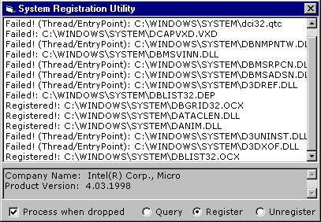



## Easy\-to\-use\- Replacement for RegSvr32\.exe

### Description

I was spending today thinking of other ideas for projects and I figured my site could use a utility to register and unregister DLLs and OCX controls like regsvr32.exe does. From what I've seen this will be the most user friendly utility of it's type and will support drag/drop and reg/unreg multiple files in one go! At the moment you pretty much find the files you want and drag 'em across and you're done. Very useful for distributing Visual Basic Apps. At the moment it is NOT commented, but that will change. It has been tested fairly well but don't be surprised if the program crashes! (it should crash a computer though) It's not all my code. I will keep updating this program til it's as good and as simple as i can make it. Input, abuse and suggestions welcome :)
 
### More Info
 

             |
---                |---
**Submitted On**   |2000-05-05 00:01:14
**By**             |[John Pettit](https://github.com/Planet-Source-Code/PSCIndex/blob/master/ByAuthor/john-pettit.md)
**Level**          |Intermediate
**User Rating**    |4.5 (18 globes from 4 users)
**Compatibility**  |VB 5\.0, VB 6\.0
**Category**       |[Complete Applications](https://github.com/Planet-Source-Code/PSCIndex/blob/master/ByCategory/complete-applications__1-27.md)
**World**          |[Visual Basic](https://github.com/Planet-Source-Code/PSCIndex/blob/master/ByWorld/visual-basic.md)
**Archive File**   |[CODE\_UPLOAD5492542000\.zip](https://github.com/Planet-Source-Code/john-pettit-easy-to-use-replacement-for-regsvr32-exe__1-7852/archive/master.zip)

